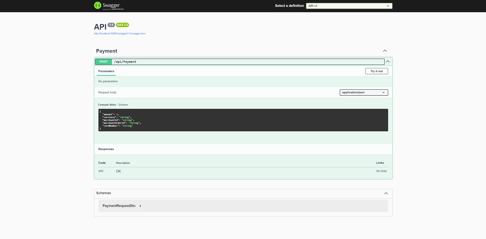
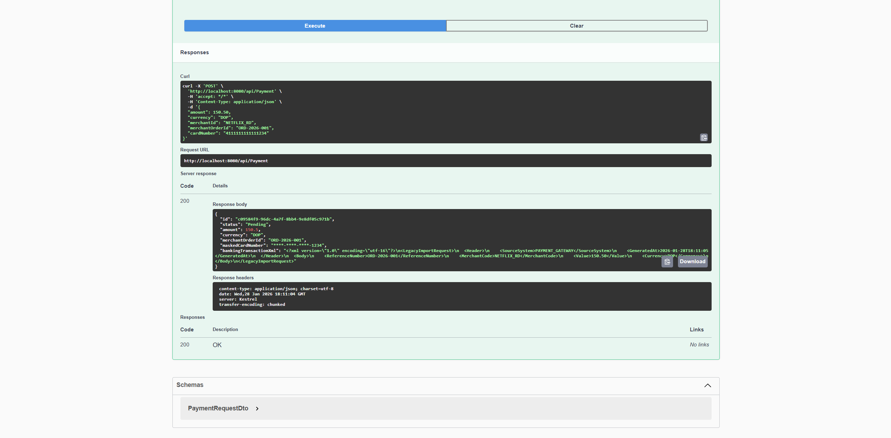
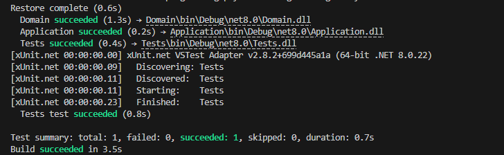

# 💳 Payment Gateway Integration Service


Una API RESTful robusta diseñada para simular una pasarela de pagos empresarial. Este proyecto implementa **Clean Architecture** para procesar transacciones, validarlas y transformarlas mediante **XSLT** para la integración con sistemas bancarios Legacy (Mainframes).

---

## 🚀 Características Principales

* **Arquitectura Limpia (DDD):** Separación estricta de responsabilidades (Domain, Application, Infrastructure, API).
* **Integración Bancaria Legacy:** Transformación de objetos modernos a XML estándar (ISO) y conversión a formatos propietarios bancarios usando **XSLT 1.0**.
* **Seguridad:** Enmascaramiento de datos sensibles (PCI DSS Compliance básico) y gestión de secretos con User Secrets.
* **Idempotencia:** Prevención de cobros duplicados basada en `MerchantOrderId`.
* **Containerización:** Despliegue automático de API + SQL Server usando **Docker Compose**.
* **Calidad de Código:** Pruebas unitarias automatizadas con **xUnit** y **Moq**.

---

## 🛠️ Tecnologías

* **Core:** .NET 8 (C#)
* **Database:** SQL Server 2022 / Entity Framework Core (Code-First)
* **Testing:** xUnit, Moq
* **DevOps:** Docker, Docker Compose
* **Integration:** System.Xml, XslCompiledTransform

---

## 📸 Galería del Proyecto

### 1. Interfaz API (Swagger)
Punto de entrada para probar los endpoints de pago.


### 2. Respuesta de Integración (JSON + XML)
La API devuelve no solo el estado del pago, sino también evidencia de auditoría (XML generado) y seguridad (Tarjeta enmascarada).


### 3. Transformación XSLT (Logs)
Evidencia de la conversión de formatos en tiempo real para el Core Bancario.


### 4. Pruebas Unitarias
Cobertura de la lógica de negocio asegurando la estabilidad del sistema.


---

## 🏗️ Arquitectura del Sistema

El proyecto sigue una estructura de capas concéntricas:

```text
src/
├── 1. Domain          # Entidades (Payment) y Reglas de Negocio Puras
├── 2. Application     # Casos de Uso (Services), DTOs e Interfaces
├── 3. Infrastructure  # Base de Datos, Repositorios e Integración (XML/XSLT)
├── 4. API             # Controladores REST y configuración de Docker
└── 5. Tests           # Pruebas Unitarias Aisladas
```
## 🐳 Ejecución Rápida (Docker)
Para levantar todo el entorno (Base de Datos + API) sin instalar dependencias:

## 1. Clonar el repositorio
git clone [https://github.com/OmR-SC/payments-integration-gateway.git](https://github.com/OmR-SC/payments-integration-gateway.git)

## 2. Levantar con Docker Compose
```
docker compose up --build
```

La API estará disponible en: http://localhost:8080/swagger

## 💻 Ejecución Local (Desarrollo)
Si prefieres correrlo con Visual Studio o VS Code:

1. Configura tu cadena de conexión en User Secrets.

2. Aplica las migraciones:

    ```
    dotnet ef database update --project Infrastructure --startup-project API
    ```

3. Ejecuta la API:

    ```
    dotnet run --project API
    ```
## 🧪 Estrategia de Pruebas

El proyecto utiliza **xUnit** para pruebas unitarias y **Moq** para aislar dependencias.

### Ejemplo de Cobertura (PaymentService)
El test `ProcessPayment_Should_SavePayment_When_OrderIsNew` verifica el flujo completo de un pago exitoso:
1.  **Mocking:** Se simula que la orden no existe en BD (`GetByMerchantOrderIdAsync` devuelve `null`).
2.  **Execution:** Se procesa el pago.
3.  **Verification:**
    * Se valida que `MaskedCardNumber` oculte los primeros 12 dígitos.
    * Se verifica con `Verify(Times.Once)` que se haya invocado el método de persistencia.

Comando para ejecutar las pruebas:

```
dotnet test
```